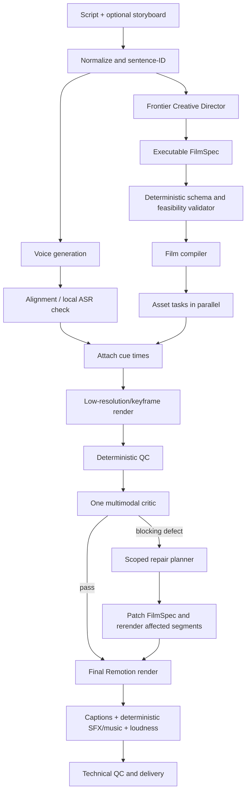

# AI Motion Graphics Studio

## Independent Build-vs-Buy / Alternative Architecture Review

**Review date:** 2026-10-09  
**Repository:** `rot-boy-v2`  
**Scope:** Read-only architecture, economics, latency, orchestration, and commercial-alternative review

## Executive conclusion

I would not build the complete system the same way from zero.

I would retain the distinctive visual engine—persistent object identity, `FilmDirection`, cue-driven choreography, `sceneAt`, the frozen Founding Visual Toolset, deterministic captions/QC, and Remotion—but replace the production pipeline surrounding it.

The strongest design is a hybrid:

- One consolidated storyboard/FilmSpec planning call, not structure + direction + per-chapter beats + per-chapter stage calls.
- ElevenLabs or equivalent for narration.
- Deterministic compilation into the retained visual engine.
- Durable code-based orchestration, preferably Temporal once productized.
- One independent multimodal review and at most one targeted repair loop.
- Incremental scene rendering rather than full-film regeneration for every change.
- Commercial image/video generation only for explicit gaps, not routine B-roll.

Expected steady state for 90–120 seconds:

- Core hybrid: approximately **$1.20–$2.70 per film**, or **$70–$160/month at 60 films**.
- Routine latency: approximately **6–12 minutes**; **10–20 minutes** with one repair.
- A fully commercial composed stack: approximately **$2.20–$5.10 per film**, usually with weaker causal continuity and more template character.

---

# 1. What the current architecture actually is

There are two different systems in the repository.

1. The product/runtime path exposed by the studio.
2. The much larger production-acceptance process used for `live-v1`.

The second is not currently an automated end-user workflow.

```mermaid
flowchart TD
    A[Script / topic] --> B[Studio UI or produce.ts]
    B --> C[/api/direct]
    C --> C1[Whole-film structure call]
    C1 --> C2[Whole-film FilmDirection call]
    C2 --> C3[Sequential beat call per chapter]
    C3 --> C4[Sequential stage/material call per chapter]
    C4 --> C5[Deterministic plan inspection]
    C5 -->|weak chapters| C6[More beat + stage calls]
    C5 --> D[StructuredPlan JSON]

    B --> E[/api/voice: ElevenLabs]
    E --> F[Audio + word alignment]
    D --> G[timeChapters]
    F --> G
    G --> H[props.json]

    H --> I[Remotion StructuredFilm]
    I -->|direction exists| J[DirectedStage + sceneAt + choreography]
    I -->|no direction| K[Chapter pieces]
    J --> L[MP4]
    K --> L

    L --> M[Manually invoked acceptance process]
    M --> M1[Technical QC]
    M --> M2[Motion / caption / conformance audits]
    M --> M3[Phone-scale evidence strips]
    M3 --> M4[Vision critic calls]
    M4 --> M5[Development agent authors patch/code repair]
    M5 --> I
    L --> M6[Sound generation, mixing and mastering]
```

Key implementation entry points:

- Product UI: `studio/App.tsx`
- Batch producer: `scripts/produce.ts`
- HTTP orchestration: `server/dev.ts`
- Planning pipeline: `server/direct-structure.ts`
- Persistent rendering: `src/film/StructuredFilm.tsx`
- Choreography and `sceneAt`: `src/film/choreography.ts`
- Vision review: `scripts/review-film.ts`

## Important rendering fact

When `plan.direction` exists, `StructuredFilm` renders `DirectedStage` and bypasses the chapter `pieces`.

That means the expensive per-chapter stage selections produced after `FilmDirection` do not contribute to the final directed picture. Beat output contributes some timing structure, but its annotations are likewise not rendered by `DirectedStage`.

For `live-v1`, 26 post-direction beat/stage calls consumed:

- approximately **$4.39**;
- **2,137 model-seconds**, or 35.6 model-minutes;
- 161,411 output tokens.

This is the clearest current architectural duplication.

---

# 2. Artifact contracts and handoffs

The runtime communicates through JSON and media artifacts, not direct agent-to-agent messages.

| Artifact | Meaning |
|---|---|
| `input-script.txt` | Spoken script after markup removal |
| `structure.json` | Chapter partition, spine, example, stage intentions |
| `film-direction.json` | Persistent objects, cue-bound events, shots |
| `beats-N.txt` | Per-chapter model response |
| `stage-N.txt` | Material-selection response and validation notes |
| `plan.json` | Combined structured plan |
| `voice.mp3` / `voice.wav` | Narration |
| `words.json` | Word timestamps |
| `props.json` | Complete Remotion input contract |
| `motion-audit.json` | Per-frame deterministic choreography audit |
| `captions-audit.json` | Caption coverage and timing |
| `conformance.json` | Cue, safe-area and hold checks |
| `film.mp4` | Rendered candidate |
| `evidence/*.png` | Phone-scale review strips |
| `review/*.request.json` | Provider/model/usage provenance |
| `review/*.response.txt` | Raw critic output |
| `review/review.json` | Aggregated critic verdict |
| `direction-repair.json` | Targeted semantic patch |

Sound is derived from performed events in `src/film/sound.ts`. SFX and music are generated deterministically rather than purchased or synthesized remotely.

---

# 3. Actual runtime reasoning/agent inventory

The runtime is not a multi-agent system in the conventional sense. It is one configured model used repeatedly with different prompts.

| Role | Backing | Input | Output | Communication |
|---|---|---|---|---|
| Optional script writer | Same configured LLM | Topic and notes | Script JSON | HTTP/JSON |
| Structure planner | Same LLM | Entire numbered script, style rules, notes | Spine, chapters, example | Files |
| Film director | Same LLM | Entire script and structure | `FilmDirection` | Files |
| Beat director | Same LLM, one call/chapter | Chapter, narration, direction excerpt | Beat annotations | Files |
| Stage/material selector | Same LLM, one call/chapter | Chapter, shortlist, direction | Piece selection and props | Files |
| Deterministic plan critic | TypeScript | Chapter plan | Defect list | In-process |
| Vision critic | Same GPT-5.6 Sol model in `live-v1` | One evidence strip, narration and rubric | Verdicts and defects | Files |
| Narration | ElevenLabs TTS | Script | Audio and alignment | HTTP/files |
| Narration QA | OpenAI transcription/audio models | Audio clips | Transcript/listening verdict | Files |
| Repair author | Not runtime | Critic artifacts and codebase | Patch/code changes | Development-agent session |

There is:

- no independent memory per role;
- no direct inter-agent messaging;
- no debate or negotiation protocol;
- no runtime repair agent;
- no durable supervisor agent.

The actual orchestrators are:

- `studio/App.tsx` for the UI;
- `scripts/produce.ts` for batch generation;
- `directStructure()` inside the Express server for model calls;
- a Claude Code/development-agent session for the `live-v1` critic/repair continuation.

Claude Code, Codex, Cursor and similar tools are therefore development operators, not end-user runtime agents.

---

# 4. Retry and fallback behavior

Current retries are scattered across functions:

- Structure: up to three attempts for complete sentence coverage.
- `FilmDirection`: up to three attempts, feeding the validation error and previous response back to the model.
- Beats: model failure falls back to deterministic/default beats.
- Stage selection: model failure falls back to a procedural piece; unusable output gets one retry.
- Deterministic critique: up to four weak chapters receive another beat and stage pass.
- Voice: SSML-shaped narration falls back to plain text.
- Alignment below 90% aborts production.
- Vision review runs in batches of three; one rejected call aborts that batch.
- Existing critic responses are reused from disk on resumption.
- Render jobs have no durable retry or state store.
- React component failures fall back to a procedural piece.
- Direction repairs must be authored externally and are then deterministically validated.

---

# 5. Actual `live-v1` cost

## Logged GPT usage

The present provenance ledger contains:

| Purpose | Completed calls | Input tokens | Output tokens | Reasoning tokens | Cost |
|---|---:|---:|---:|---:|---:|
| Direction | 36 | 307,763 | 292,487 | 200,885 | **$7.28** |
| Vision criticism | 44 | 112,310 | 199,740 | 148,640 | **$4.48** |
| Total | **80** | **420,073** | **492,227** | **349,525** | **$11.76** |

There were also three failed vision calls after credit exhaustion.

The calculation uses the currently published GPT-5.6 Sol standard rates: $4/M uncached input, $0.40/M cached input, $5/M cache writes and $20/M output. Reasoning tokens are included in output-token billing.

Official pricing: <https://developers.openai.com/api/docs/models/gpt-5.6-sol>

Approximately 84% of the logged GPT cost was output tokens. The universal use of `high` reasoning is the dominant reason.

## Direction call lineage

| Run | Calls | Cost |
|---|---:|---:|
| Provider probe | 1 | $0.002 |
| Natural direction | 16 | $3.03 |
| Timeout/restart attempt | 1 | $0.17 |
| Structure plus three rejected full directions | 4 | $1.60 |
| c1 full redirection | 14 | $2.47 |

## Vision lineage

| Review | Calls | Cost |
|---|---:|---:|
| Probe | 1 | $0.003 |
| Natural | 8 | $0.86 |
| c1 partial | 3 | $0.31 |
| Final before/after strips | 8 | $0.99 |
| Final | 8 | $0.86 |
| Final2 | 8 | $0.76 |
| Final3 | 8 | $0.70 |

The continuation after the initial delivery report added roughly **$3.31** in logged critic calls.

## Unlogged metered work

Repository artifacts indicate approximately:

- 14 ElevenLabs TTS calls: one full narration and repeated repair attempts;
- roughly 7,355 spoken input characters across the original and repair attempts, excluding uncertainty about SSML billing;
- at least 38 transcription calls inferred from repair checks and adjudication artifacts;
- 14 GPT-Audio listening checks.

Exact TTS, transcription and audio-model charges cannot be reconstructed because request usage and prices were not recorded with the artifacts.

ElevenLabs currently prices ordinary TTS at approximately one credit per character; its Creator plan is $22 for 121,000 credits.

Official pricing: <https://elevenlabs.io/pricing>

Local Remotion rendering, ffmpeg, deterministic music and SFX generated no API charge, though compute and electricity were not metered.

## Why this does not reconcile exactly with “over $20”

The repository can prove approximately $11.76 of GPT-5.6 Sol usage. It cannot prove:

- ElevenLabs cash charges;
- audio/transcription charges;
- coding-assistant plan usage;
- other API activity outside `LLM_PROVENANCE_LOG`;
- taxes or account-level spending unrelated to this film.

Therefore, the claimed account-credit decrease may be real, but an exact film-level reconciliation is currently impossible.

---

# 6. Latency

## Measured evidence

- Logged direction inference: **3,382 seconds**, all effectively sequential.
- Logged vision inference: **2,861 aggregate seconds**, partially parallelized in batches of three.
- Natural planning: approximately **25 minutes**.
- c1 planning: approximately **20 minutes**.
- Natural render: **7.3 minutes**.
- c1 render: **10.6 minutes**.
- Eight completed full picture renders: approximately **86 aggregate render-minutes**.
- Artifact history from the first probe to the unfinished c8 render spans more than nine hours, including a long inactive gap.

The latest complete render at inspection time was `final3`. Its critic marked only two of eight strips publishable and reported 20 major defects. A subsequent c8 direction patch was created and passed deterministic audits, but its render was only 50% complete at the inspection snapshot.

## Structural latency

- Six chapter beat calls and six stage calls are serialized.
- Each call uses high reasoning and often runs 40–120 seconds.
- Entire scripts, style rules and portions of direction are repeatedly sent.
- Failed direction validation regenerates the whole large `FilmDirection`.
- Planning and narration are unnecessarily sequential.
- Tiny semantic patches require full-film renders.
- Vision reviews repeat overlapping footage: hook, first 30 seconds, and chapter one.
- Sound-only changes c3–c5 re-rendered the full picture.
- Repair rounds trigger another render/evidence/critic sequence.

## Accidental latency

- Initial HTTP header timeout.
- One abandoned structure-only restart.
- Three rejected full `FilmDirection` responses.
- Credit exhaustion.
- Four narration-repair generations.
- Production-time renderer/code changes.
- Disk and bundle-management work.
- Repeated critics with inconsistent outcomes.

---

# 7. Duplication and waste

The most material findings are:

1. **Unused stage work.** The directed renderer does not render chapter pieces, yet every chapter receives a stage/material call.
2. **Mostly redundant beat work.** Model-authored annotations are not rendered in the directed path. Beat grouping mainly supplies timing scaffolding that can be deterministic.
3. **Overlapping planning responsibilities.** Structure, `FilmDirection`, beats and stages repeatedly decide scene division, object choice, progression and presentation.
4. **Repeated global context.** Style rules, direction objects and tool information are resent chapter by chapter.
5. **Expensive model everywhere.** Retrieval validation, short label writing and routine visual criticism all use GPT-5.6 Sol at high reasoning.
6. **Whole-pipeline restart after failure.** There is no durable checkpoint that resumes at a failed activity.
7. **Critic multiplication.** Five complete eight-strip reviews and one partial review were run. The same final film produced different blocking/publishability judgments depending on strip format and review run.
8. **Full-film rerendering.** Audio changes and narrow direction patches repeatedly render all 10,374 frames.
9. **Narration QA escalation.** Four repair generations, multiple transcription models and 14 audio listening checks were used for three bounded defects.
10. **R&D inside production.** New renderer capabilities, caption behavior and sound systems were built during the supposedly marginal production run.

The critic is also noisy: `final2` fell to 16 major defects, while `final3`, after further work, rose to 20. It is useful evidence but not a calibrated acceptance oracle.

---

# 8. Quality-critical expensive intelligence

Some expensive reasoning produced clear value and should not simply be removed.

- Whole-film `FilmDirection` established the through-line, persistent identities and actual/hypothetical/recap truth.
- The full c1 redirection corrected the static opening and separated the lost lead from the successful working lead.
- Vision criticism found semantic errors deterministic checks could not detect, including future information and conflicting object state.
- Repair judgment required understanding whether a defect belonged in direction, renderer code, audio or evidence.
- The global concept and storyboard are where frontier intelligence matters most.

The low-value use of frontier reasoning is chiefly per-chapter stage selection, beat decoration, repeated rubric narration and label-level work.

---

# 9. Storyboard-layer assessment

A storyboard layer is strongly beneficial only if it replaces existing passes.

Adding it above the current structure + direction + beats + stage stack would merely add another call.

The correct storyboard is an executable `FilmSpec`, containing:

- sentence/span ownership;
- scene and shot boundaries;
- stable object IDs;
- material IDs from the Founding Visual Toolset;
- object introduction and state events;
- actual/hypothetical/recap mode;
- camera/composition intent;
- presenter channel;
- UI/software state;
- cue phrases;
- asset requirements and execution gaps.

This would reduce:

- construction of unused chapter stages;
- incoherent material choices;
- downstream semantic repair;
- repeated prompt context;
- invalid cues;
- full-film regeneration.

It also provides a clean contract for a user-supplied storyboard: normalize it into the same `FilmSpec`, validate it, and ask a model only to fill missing execution fields.

Storyboard planning and narration can run concurrently because both can reference sentence IDs. Word timestamps are attached afterward.

---

# 10. Recommended architecture from scratch



## Model-backed roles

| Role | Preferred model | Frontier? | Parallel? |
|---|---|---:|---:|
| Creative Director | GPT-6.1 Sol medium/high, or equivalent Claude model | Yes | Runs with TTS |
| Storyboard normalizer | Cheap structured model or deterministic parser | No | Yes |
| Material retrieval | Deterministic semantic index/embeddings | No | Yes |
| Label/prop compressor | GPT-6 Luna or local 14–32B model | No | Yes |
| Vision critic | GPT-6.1 Sol medium, one multi-image request | Preferably | After preview |
| Repair planner | Same class as director, scoped input | Yes | Only on failure |
| Narration transcription | Local Whisper/faster-whisper or cheap ASR API | No | Yes |
| Media generation | Runway or image API only for declared gaps | Specialized | Yes |

OpenAI currently positions GPT-6.1 Sol as the cost/intelligence balance at $2/M input and $10/M output, while GPT-6 Luna is intended for focused high-volume work at $0.10/M input and $0.50/M output.

Official model guide: <https://developers.openai.com/api/docs/models>

I would not self-host the main creative model at 60 films/month. Utilization is too low to justify GPU purchase, serving and maintenance. Local ASR and cheap deterministic/local utility models are sensible.

---

# 11. Orchestration: n8n versus code versus Temporal

| Dimension | Current code | n8n | Temporal |
|---|---|---|---|
| Role separation | Modules and files | Visually explicit | Typed activities/workflows |
| Durable state | No; files and in-memory render map | Execution history | First-class durable state |
| Retries | Embedded/manual | Easy basic retry | Strong policies, timeouts, heartbeats |
| Branching | Hard-coded | Easy visually | Typed and testable |
| Parallel work | Limited | Easy for API nodes | Native child activities |
| Large media/artifacts | Natural locally | Awkward unless externalized | External workers/object storage |
| Long Remotion jobs | Native | Requires worker/webhook wrapper | Natural activity |
| Debugging | Good code-level, poor run-level | Good execution UI | Excellent workflow history |
| Maintenance | Simple until failures multiply | Visual sprawl risk | More initial engineering |
| Platform cost | None | Subscription/self-hosting | Tiny at this volume |
| Custom renderer flexibility | Excellent | Indirect | Excellent |

I would not use n8n as the core production engine. The actual work consists of typed JSON contracts, large media, custom validators and long-running local rendering. n8n would become a wrapper around external workers.

It is useful for intake, publishing notifications, approvals and connecting storage/social channels.

For the core I would use Temporal Cloud, or initially a PostgreSQL job table plus a typed queue if launch simplicity matters more than durable orchestration. Temporal currently has no base fee and starts around $50 per million actions, making its consumption cost negligible at 60 films/month.

- Temporal pricing: <https://temporal.io/pricing>
- n8n pricing: <https://n8n.io/pricing/>

---

# 12. Serious commercial/composed-services architecture

The closest buy-oriented stack would be:

- n8n or Make for intake, scheduling and delivery.
- GPT/Claude for storyboard JSON.
- ElevenLabs for voice.
- A commissioned set of branded Lottie/SVG templates.
- Shotstack or Creatomate for JSON-driven assembly and cloud rendering.
- HeyGen only for short presenter inserts.
- Runway only for occasional physical or cinematic gaps.
- S3/Cloudinary for assets and delivery.
- A multimodal model for one QC pass.

Shotstack currently offers 250 rendered minutes for $39/month, enough for 60 two-minute films, and exposes JSON/API/n8n integrations.

Shotstack pricing: <https://shotstack.io/pricing/>

Runway 1080p `wan3` costs 20 credits/second at $0.01/credit—about $1 for a five-second generated clip.

Runway API pricing: <https://docs.dev.runwayml.com/guides/pricing/>

HeyGen standard API avatar output is around $1/minute, while Avatar IV is around $4/minute.

HeyGen API pricing: <https://help.heygen.com/en/articles/10060327-heygen-api-pricing-explained>

## Where it wins

- Faster initial deployment.
- Managed rendering and scaling.
- Easier operational support.
- Strong avatar and generative-media capability.
- Predictable subscriptions.
- Less renderer infrastructure.

## Where it loses

- Persistent semantic identity across scenes.
- Exact event/cue truth.
- Film-specific explanatory causality.
- Deterministic UI/software state.
- Fine control of typography and phone readability.
- Distinctive house art direction.
- Vendor portability.

No current single SaaS product provides the target outcome. A commercial solution still needs a carefully commissioned template system and planning contract; otherwise it becomes precisely the generic B-roll/template product the objective rejects.

---

# 13. Economics for 90–120 seconds and 60 films/month

## Recommended hybrid

| Cost | Per film | Monthly |
|---|---:|---:|
| Planner + critic + average repair | $0.35–$1.00 | $21–$60 |
| Narration | $0.35–$0.60 | $22–$35 |
| Render compute | $0.10–$0.40 | $6–$24 |
| Temporal | <$0.02 | <$1 |
| Storage/CDN | $0.03–$0.13 | $2–$8 |
| Occasional media APIs | $0–$1.00 | $0–$60 |
| Failed/retry allowance | $0.15–$0.35 | $9–$21 |
| **Total** | **$1.20–$2.70** | **$70–$160 typical** |

This assumes generated video is exceptional rather than routine.

## Commercial/composed stack

| Cost | Monthly |
|---|---:|
| n8n/Make | $20–$50 |
| Shotstack/Creatomate | about $39 |
| ElevenLabs | $22–$35 |
| LLM planning/QC | $20–$60 |
| Short presenter inserts | around $10 |
| Runway media | $0–$60 |
| Storage | $5–$10 |
| Retry allowance | $15–$40 |
| **Total** | **$130–$300**, or **$2.20–$5.10/film** |

Full-film avatar use could add roughly $120/month at standard HeyGen pricing or much more for Avatar IV.

## Current architecture projected to two minutes

A successful single pass likely lands around:

- $2.50–$3.80 model cost;
- roughly $0.40 narration allocation;
- $0.10–$0.40 render compute.

With one current-style review/repair round, a practical estimate is **$4–$7 per film**, or **$240–$420/month**, excluding development-agent time.

That estimate is inherently weak because the repair step is not actually automated.

## Development/R&D versus marginal spend

From zero:

- Recommended custom hybrid: roughly 8–16 engineering weeks plus 3–6 motion-design weeks.
- Commercial composed stack: 1–3 integration weeks plus approximately $5,000–$20,000 of branded template/design work.
- Retaining the existing repository should reduce hybrid productization to roughly 4–8 engineering weeks because the valuable visual core already exists.

These are resource estimates, not costs recoverable from repository accounting.

---

# 14. Expected latency

| Architecture | Routine film | With one repair |
|---|---:|---:|
| Current pipeline | 20–45 minutes | Unbounded/manual |
| Recommended hybrid | 6–12 minutes | 10–20 minutes |
| Commercial, no generated video | 6–15 minutes | 10–20 minutes |
| Commercial with generated clips | 10–30 minutes | 20–45 minutes |

In the recommended design:

- planning and TTS run concurrently;
- independent asset tasks run concurrently;
- only script normalization → FilmSpec → compilation → review → finalization is sequential;
- the critic reviews one compact multi-image package;
- targeted changes rerender only affected segments before the final encode.

---

# 15. Observability status

| Question | Current answer |
|---|---|
| Exact film cost | No |
| Cost per stage | No |
| Tokens by model | Partly; OpenAI Responses only |
| Stage duration | No central record |
| Retry count | Inferable from files, not directly reported |
| Repair-loop cost | Partly |
| Model inference time | Yes for logged Responses calls |
| Render time | Inferable from timestamps, not formally recorded |
| Narration time | Inferable only |
| Narration/API cost | No |
| Development-agent contribution | No |
| End-to-end job state | No |

The ledger in `out/live-v1/llm-provenance.jsonl` is useful, but lacks job IDs, stage IDs, prompt hashes, unit prices and all non-Responses providers.

The acceptance document is also stale relative to later artifacts: it reports 12 completed vision calls and says the final lacked an independent GPT review, while the current ledger contains 44 completed vision calls and later `final`, `final2`, and `final3` reviews.

---

# 16. What is worth preserving

The durable competitive value is:

- `FilmDirection` as a typed cinematic contract.
- Stable object identity across the film.
- Actual/hypothetical/recap state truth.
- `sceneAt` and event-sourced choreography.
- The Action Registry’s semantic motion vocabulary.
- The frozen Founding Visual Toolset.
- Deterministic phone-safe layout.
- Script preservation and narration-as-clock.
- Cue-aligned captions.
- Deterministic motion/caption/conformance QC.
- Rendered phone-scale evidence.
- Targeted direction patches.
- The presenter and distinctive art language.
- Remotion as a controllable, deterministic renderer.

The Founding Visual Toolset is a strong foundation, but the future FilmSpec must reference its stable material IDs directly. The current directed renderer does not meaningfully consume most chapter material selections.

---

# 17. Complexity that is probably not worth preserving

- Four overlapping creative planning layers.
- Per-chapter frontier calls after the global direction already exists.
- Multiple production render paths (`BoardFilm`, older `Film`, `StructuredFilm`) as equal runtime concepts.
- Universal high reasoning.
- Full-film regeneration for audio-only and tiny semantic changes.
- Vision review of heavily overlapping strips.
- Unlimited critic/repair continuation.
- In-memory render-job state.
- JSON files as the only workflow database.
- Production processes that rely on a coding assistant to interpret critic findings.
- Acceptance prose that can drift out of sync with later artifacts.

---

# Final recommendation

Retain and productize the visual core; substantially redesign the production pipeline.

Specifically:

1. Replace structure + direction + beats + stages with one executable storyboard/FilmSpec.
2. Let user storyboards enter through that same contract.
3. Run the creative director and TTS concurrently.
4. Compile the FilmSpec deterministically into the retained Remotion engine.
5. Give the Founding Visual Toolset real stable-ID participation in the directed renderer.
6. Use a frontier model only for the whole-film concept, one visual critic, and exceptional repair judgment.
7. Use cheap/local/deterministic systems for retrieval, formatting, captioning, ASR and QC.
8. Allow one scoped repair loop by default.
9. Render previews and affected scenes incrementally.
10. Use Temporal or a typed durable queue for production; reserve n8n for external automation.
11. Keep commercial APIs for commodity capabilities—voice, storage, optional media and compute—not for the studio’s narrative intelligence.

So the answer is neither “keep everything” nor “replace it with SaaS.”

The best system is a simplified hybrid whose proprietary center is the existing causal visual language, with the expensive and operationally generic surroundings consolidated or outsourced.

---

## Principal repository evidence inspected

- `references/FOUNDING_VISUAL_TOOLSET.md`
- `src/founding-toolset/registry.ts`
- `server/direct-structure.ts`
- `server/openai-responses.ts`
- `server/voice.ts`
- `src/film/direction.ts`
- `src/film/StructuredFilm.tsx`
- `src/film/DirectedStage.tsx`
- `src/film/choreography.ts`
- `src/film/sound.ts`
- `scripts/produce.ts`
- `scripts/review-film.ts`
- `scripts/repair-direction.ts`
- `scripts/repair-narration.ts`
- `scripts/technical-qc.ts`
- `scripts/audit-motion.ts`
- `scripts/audit-captions.ts`
- `scripts/conform-plan.ts`
- `scripts/film-evidence.py`
- `out/live-v1/llm-provenance.jsonl`
- `out/live-v1/ACCEPTANCE_EVIDENCE.md`
- `out/live-v1/natural/`
- `out/live-v1/c1/` through `out/live-v1/c8/`
- `out/live-v1/final/`, `final2/`, and `final3/`

